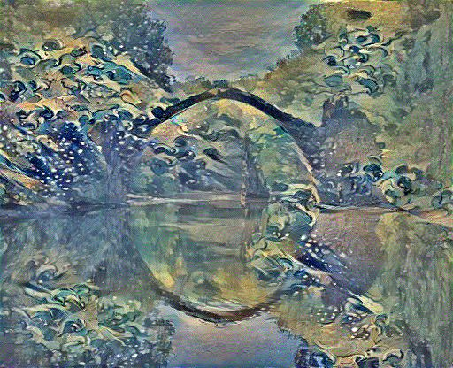

## Neural Style Transfer - Gatys et al.

A from-scratch, fully-modular PyTorch implementation based on the original paper -
[Image Style Transfer Using Convolutional Neural Networks](https://www.cv-foundation.org/openaccess/content_cvpr_2016/papers/Gatys_Image_Style_Transfer_CVPR_2016_paper.pdf)

---

### Features

* **Modular Feature Extraction:** Uses VGG-based feature hierarchies with selectable layers for controlling content and style fidelity.
* **Style Representation via Feature Statistics:** Computes and matches feature correlations through Gram matrices to achieve robust texture and style transfer.
* **Optimizable Image Generation:** Synthesizes the stylized image directly in pixel space using gradient-based optimization with support for both L-BFGS and Adam.
* **Configurable Loss Framework:** Allows independent tuning of content, style, and total-variation losses, enabling different stylization strengths and smoothness profiles.
* **Flexible Initialization:** Supports initializing the generated image from the content image, the style image, or random noise to control convergence behavior.
* **Reproducible Experimentation:** Provides structured argument parsing, deterministic configuration, and consistent preprocessing for reliable results.
* **Clean Image I/O Pipeline:** Includes standardized loading, normalization, and post-processing to ensure output correctness across models and resolutions.
* **Extensible Codebase:** Organized into independent modules, making it straightforward to add new loss terms, new models, or alternative style representations.

---

### Example Results
| Content Image  | Style Image    | Stylized Output |
| -------------- | -------------- | --------------- |
|  |  |   |

---

### Project Structure
```
├── src/
│   ├── main.py                   # Entry point and main pipeline
│   ├── models/
│   │   ├── vgg.py                # VGG16/VGG19 feature extractor
│   ├── utils/
│   │   ├── image.py           # Image loading, saving, preprocessing
│   │   ├── losses.py         # Loss computations
│   │   └── model.py            # Model preparation and gram matrix calculation  
│   └── data/
│       ├── content-images/       # Input content images
│       ├── style-images/         # Input style references
│       └── output/               # Stylized results
├── requirements.txt
├── README.md                     
└── .gitignore
```

---

### Setup

1. Install Dependencies
```bash
pip install -r requirements.txt
```

2. Run Style Transfer
```bash
python main.py
```

3. Optional Flags
* **`--content_image`** — Path to the image whose structural content is preserved in the stylized output.
* **`--style_image`** — Path to the image providing stylistic features applied to the stylized output.
* **`--content_weight`** — Controls how strongly content structure influences the final stylized image.
* **`--style_weight`** — Controls the intensity and dominance of style features in the stylized result.
* **`--total_variation_weight`** — Regularization weight that smooths the stylized output and reduces noise.
* **`--optimizer`** *(`lbfgs`, `adam`)* — Optimization algorithm used to iteratively refine the stylized image.
* **`--model`** *(`vgg16`, `vgg19`)* — VGG backbone used as the fixed feature extractor for content and style features.
* **`--init_method`** *(`content`, `style`, `random`)* — Initialization strategy for constructing the starting point of the stylized image.